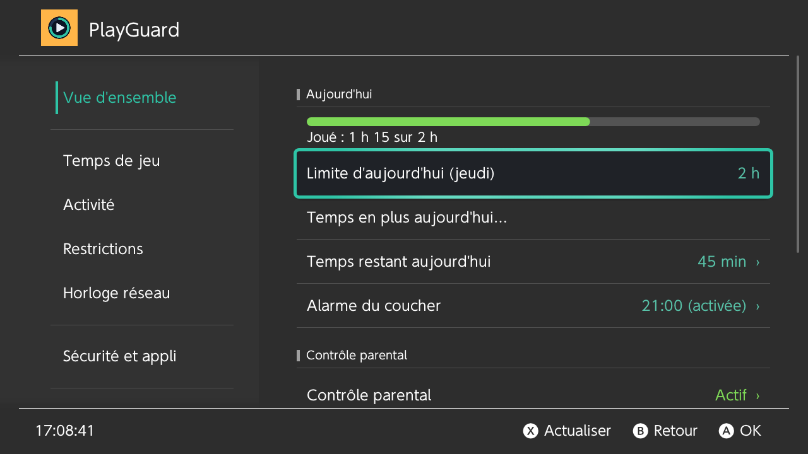

# PlayGuard

*[Read in English](README.md)*

Un gestionnaire du contrôle parental de la Nintendo Switch — **sans application mobile, sans compte Nintendo, sans Internet**. Réglez la limite quotidienne de temps de jeu directement sur la console, modifiez les restrictions, réglez l'horloge réseau, et réinitialisez / supprimez le code PIN ou dissociez l'application mobile.

> ⚠️ **Nécessite un firmware personnalisé (Atmosphère).** L'application dialogue avec le service système restreint `pctl` : elle ne fonctionne que sur une console modifiée. Elle ne contourne aucune vérification de compte ou en ligne : elle ramène sur la console, hors ligne, des réglages sinon réservés à l'application mobile (ou cachés dans les paramètres). Certaines commandes utilisées sont des commandes `*ForDebug`. **À utiliser à vos risques.**

## Compatibilité

| | Pris en charge | Remarques |
|---|---|---|
| Firmware | **21.0.0 → 23.0.1** | La structure de la limite de temps de jeu (0x44 octets) existe depuis 21.0.0. En dessous, tous les onglets fonctionnent sauf le temps de jeu. Sur un firmware plus récent, l'application démarre **en lecture seule** et cherche une version de PlayGuard qui le prend en charge (voir ci-dessous). |
| Atmosphère | **1.11.x → 1.12.0** | 1.12.0 ajoute 23.0.0. L'application affiche la version détectée. |
| Lanceurs | hbmenu, **sphaira**, **Homebrew App Store** | Le lancement par-dessus un jeu (title override) est recommandé ; l'application indique si elle tourne en application ou en applet (album). |
| Testé sur console | 22.1.0 / Atmosphère 1.11.1 | 23.0.1 / 1.12.0 est couvert par la table des commandes (switchbrew) mais pas encore testé sur console : vos retours sont bienvenus. |

**Firmware plus récent.** L'écran *Firmware pas encore pris en charge* consulte la dernière version publiée : si elle prend en charge le firmware, il propose de mettre à jour avec sphaira ou le Homebrew App Store (Outils › *Mettre à jour avec*). Sinon, vous continuez en lecture seule, en lecture seule avec les outils développeur (pour diagnostiquer le firmware) ou avec toutes les fonctions à vos risques ; le choix peut être mémorisé pour ce firmware et cette version de l'application. Outils › *Compatibilité* rouvre l'écran.

**Pourquoi plus de plantage en 22.5.** `pctl:a`, le service privilégié du contrôle parental, n'accepte **qu'une seule session**. Les anciennes versions de l'application d'origine la gardaient ouverte en permanence : l'écran PIN du menu HOME (ou l'applet PIN) ne pouvait pas l'obtenir et Atmosphère pouvait planter. Dans PlayGuard, chaque action ouvre la session, fait son travail et la libère aussitôt ; les rafraîchissements périodiques s'arrêtent quand l'application est en arrière-plan. *(Diagnostic du [fork d'anbingxi](https://github.com/anbingxi/NX-Pctl-Manager/tree/diag/fw22-5-readonly).)*

## Fonctions

L'application est organisée en onglets, comme les paramètres de la console.

| Onglet | Ce que vous pouvez faire |
|---|---|
| **Vue d'ensemble** | D'abord la journée (jauge du temps de jeu, limite du jour, temps restant, alarme du coucher), puis l'état du contrôle parental, le code PIN et le niveau de restriction, puis ce qui demande attention : précision de l'horloge réseau, association de l'application mobile (en orange tant qu'elle est associée), firmware / compatibilité seulement en cas de problème. Les lignes qui ouvrent un autre onglet se terminent par un chevron (›) ; Ⓐ sur *Limite d'aujourd'hui* la modifie directement, et Ⓐ sur *Horloge réseau › Imprécise* propose de mesurer et de régler l'horloge sur place. Tant qu'aucun code PIN n'est défini, une ligne **Premiers pas** ouvre le guide en trois étapes (code PIN, limite quotidienne, horloge réseau), qui s'affiche aussi de lui-même au lancement. **Temps en plus aujourd'hui** (+15 min, +30 min, +1 h sur la limite du jour ; à la prochaine ouverture un autre jour, l'application propose de remettre la limite habituelle). Un bandeau avec **Verrouiller maintenant** apparaît tant que le contrôle parental est déverrouillé temporairement. Actualisation toutes les 5 s, avec l'heure de la dernière actualisation (Ⓧ pour actualiser tout de suite). |
| **Temps de jeu** | Une ligne d'état (actif, temps restant, limite du jour, profil correspondant ; une ligne rouge tant que la limite est atteinte), puis **le graphique de la semaine, qui sert d'éditeur** : ←/→ choisit un jour, Ⓐ change sa limite. Même limite tous les jours (liste rapide ou valeur libre, en minutes ou sous la forme `1:30`), limite différente par jour (le même graphique avec les jours non enregistrés en orange, valeurs rapides, préréglages lundi–vendredi / week-end, « pas de limite » par jour, Ⓨ enregistre depuis n'importe où), suppression de la limite, **temps en plus aujourd'hui** (comme dans la Vue d'ensemble), écran **Profils** pour les limites enregistrées sur la carte SD (ex. *Semaine d'école*, *Vacances* : appliquer, enregistrer les limites actuelles, supprimer), alarme du coucher (lecture seule). Avancé, sur activation : alarme « temps écoulé », pause / reprise du décompte. |
| **Activité** | Temps passé sur chaque jeu **aujourd'hui**, sur les **7 derniers jours** et **depuis toujours**, pour tous les comptes, lu dans le journal d'activité de la console, avec les totaux du jour et de la semaine. Tri de la liste par période ; les premiers jeux portent leur icône (pas en mode applet, pour économiser la mémoire) ; Ⓐ sur un jeu ouvre son écran : ses sept derniers jours en barres, ses lancements, ses première et dernière parties et le temps de chaque compte. **Export sur la carte SD** en CSV, JSON, XLSX (Excel) ou PDF. Durées approximatives si l'horloge de la console a été modifiée. |
| **Restrictions** | Niveau de restriction (Aucun, Jeune enfant, Enfant, Adolescent, Personnalisé) ; ce que le préréglage choisi impose (limite d'âge, publications, communication) est affiché en lecture seule, et le sélecteur le dit avant de choisir ; en Personnalisé : classification par âge, publications sur les réseaux sociaux, communication avec d'autres joueurs ; mode VR ; organisme de classification. |
| **Horloge réseau** | Horloges console / réseau, fuseau horaire, précision. Choix d'un serveur NTP public (≈ 50 intégrés, par région, ou le vôtre), **mesure** sur 3 serveurs (indicateur d'attente pendant la mesure ; médiane, alerte orange en cas de désaccord) et **réglage de l'horloge réseau** (une mesure reste utilisable 2 minutes, avec un décompte). Le minuteur s'appuie sur cette horloge ; une console qui n'atteint jamais les serveurs de Nintendo la garde imprécise. |
| **Sécurité et appli** | Définir / changer le code PIN (écran système), **afficher le code PIN** (après un avertissement, en cas d'oubli), déverrouiller temporairement, **verrouiller maintenant**. *Application mobile* : association de l'application Contrôle parental Nintendo Switch, dernière synchronisation, dissociation (sinon sa prochaine synchronisation écrase les limites réglées ici). Supprimer tout le contrôle parental (ligne en rouge ; deux confirmations aux boutons rouges différents, irréversible ; une sauvegarde des réglages est d'abord enregistrée). |
| **Préférences** | Langue et thème (avec proposition de relancer), onglet d'ouverture, **reverrouillage automatique après une modification** (activé par défaut), montants du temps en plus, remise de la limite habituelle le lendemain sans demander, vérification de l'horloge réseau au lancement, actions avancées. |
| **Outils et à propos** | *Premiers pas* rouvre le guide. Export d'un rapport de diagnostic, **sauvegarde / restauration des réglages** sur la carte SD (niveau de restriction, réglages personnalisés, mode VR, limites quotidiennes ; pas le code PIN), **recherche de mise à jour** (*Mettre à jour avec* : sphaira, Homebrew App Store ou à la main). *Console* : firmware, Atmosphère, compatibilité, **stockage** (emuMMC ou sysMMC), **masquage du numéro de série** par Atmosphère (avec le numéro vu par le système, en partie caché jusqu'à Ⓐ ; avertissement en emuMMC s'il n'est pas masqué), **patchs de jeux** (sys-patch ou fichiers sigpatches, avec un avertissement recommandant sys-patch quand seuls des fichiers sont utilisés). La Vue d'ensemble reprend ces deux avertissements. |

### Écriture sûre de la limite

Si le minuteur est en cours, écraser sa configuration déstabilise Atmosphère. Avant toute écriture, l'application vérifie donc l'état ; si le minuteur est actif, le dialogue de confirmation indique aussi que le contrôle parental sera d'abord déverrouillé temporairement (avec le code PIN enregistré — **inutile de vous en souvenir**). Un seul appui déverrouille, vérifie que le système confirme bien le déverrouillage, écrit, puis **reverrouille aussitôt** (ou le propose, si *Reverrouiller automatiquement après une modification* est désactivé). La couche service revérifie le même état juste avant d'écrire : aucun écran ne peut contourner cette protection.

`0` minute signifie *pas de jeu ce jour-là* ; *Supprimer la limite de temps de jeu* désactive le minuteur. ⚠️ Une limite inférieure au temps déjà joué aujourd'hui suspend le jeu dès que le contrôle parental est reverrouillé ; la confirmation le signale quand c'est le cas.

## Installation

Au choix :

- **Homebrew App Store** ou **App Store de sphaira** (même catalogue) : cherchez *PlayGuard* une fois la fiche validée. Les nouvelles versions GitHub sont reprises automatiquement.
- **Menu GitHub de sphaira** : le zip de la version contient déjà l'entrée (`/config/sphaira/github/playguard.json`) ; après une première installation, la mise à jour se fait depuis *GitHub* dans sphaira.
- **Manuellement** : téléchargez `playguard.zip` dans les [Releases](../../releases/latest) et extrayez-le à la **racine** de la carte SD. L'application arrive dans `sd:/switch/playguard/`.

### Premiers pas

1. **Contrôle parental pas encore configuré :** ouvrez l'application : l'écran *Premiers pas* définit le code PIN (écran système), la limite quotidienne et vérifie l'horloge réseau.
2. **Déjà associée à l'application mobile :** *Sécurité et appli* › *Dissocier l'application mobile*, sinon la prochaine synchronisation écrase vos réglages.
3. *Temps de jeu* › *Même limite tous les jours* (ou *Limite différente selon le jour…*).
4. Si l'horloge réseau n'est pas précise (Vue d'ensemble) : *Horloge réseau* › *Mesurer l'écart* puis *Régler l'horloge réseau* (activez d'abord *Synchroniser l'horloge via Internet* dans les paramètres).

Commandes : ↑/↓ déplacer, Ⓐ valider, Ⓑ retour ou annuler (sur la barre latérale : Ⓑ deux fois pour quitter), Ⓧ actualiser, Ⓨ supprime un profil enregistré et enregistre les limites par jour. Le focus saute les lignes d'état ; ce qui a échoué est dit dans une boîte de dialogue, ce qui a réussi dans une notification. Le titre indique quand l'application est en lecture seule et tant que le contrôle parental est déverrouillé temporairement.

## Signaler un bug

*Outils et à propos* › *Exporter un rapport de diagnostic* enregistre un fichier texte dans `sd:/switch/playguard/logs/` (firmware, version d'Atmosphère, horloges, résultat brut de chaque requête). Il indique aussi le stockage, le masquage du numéro de série et l'état des patchs de jeux. **Il ne contient jamais le code PIN ni le numéro de série.** Joignez-le au ticket.

Le **mode développeur** (appuyez sept fois sur *Outils et à propos* › *Version*) ajoute un interrupteur de lecture seule, le rapport de diagnostic à l'écran et un raccourci pour l'exporter depuis l'onglet Temps de jeu. En lecture seule, l'application ne peut rien modifier : c'est la façon sûre d'examiner un nouveau firmware (l'écran firmware le propose directement).

La compilation et l'architecture sont décrites dans le [README anglais](README.md#build-from-source).

## Licence

GPLv3 (voir [`LICENSE`](LICENSE)). PlayGuard est maintenu par **[JigSawFr](https://github.com/JigSawFr)**. C'est un fork de **Pctl Manager** de **Taylor** ([tailiang2008](https://github.com/tailiang2008)) : couche de service pctl, garde-fou d'écriture du minuteur et interface borealis d'origine. Interface : [borealis](https://github.com/xfangfang/borealis) (Apache 2.0). Diagnostic fw 22.5, libération de session et synchronisation NTP adaptés du [fork d'anbingxi](https://github.com/anbingxi/NX-Pctl-Manager/tree/diag/fw22-5-readonly).
