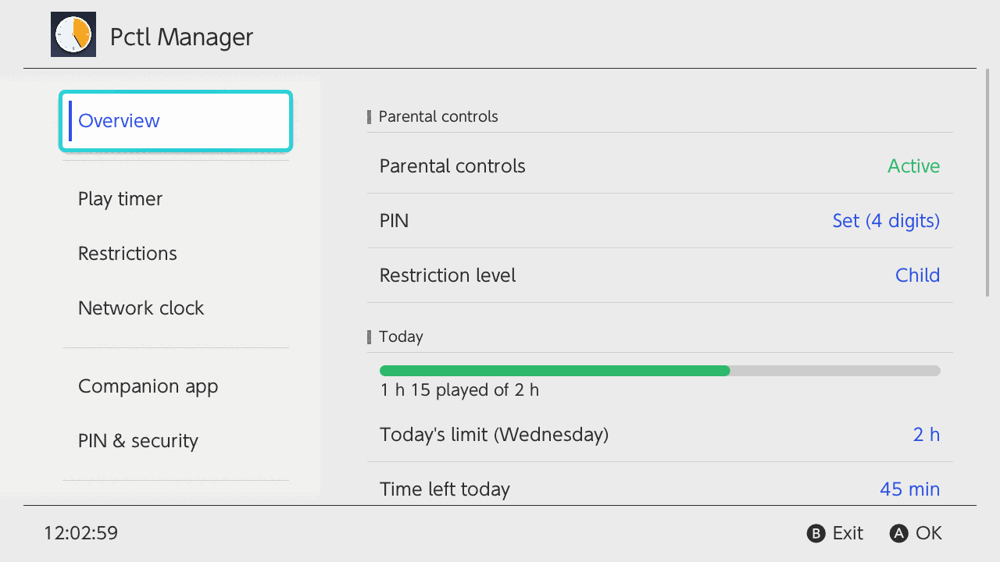
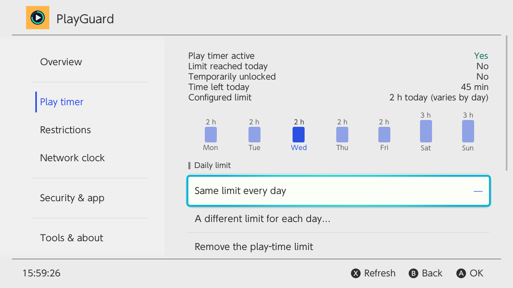
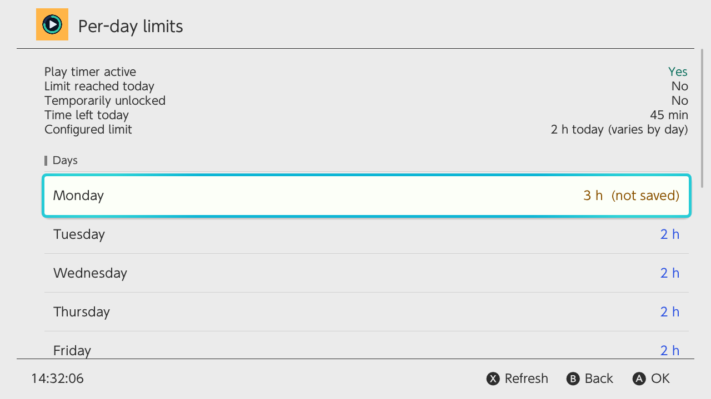
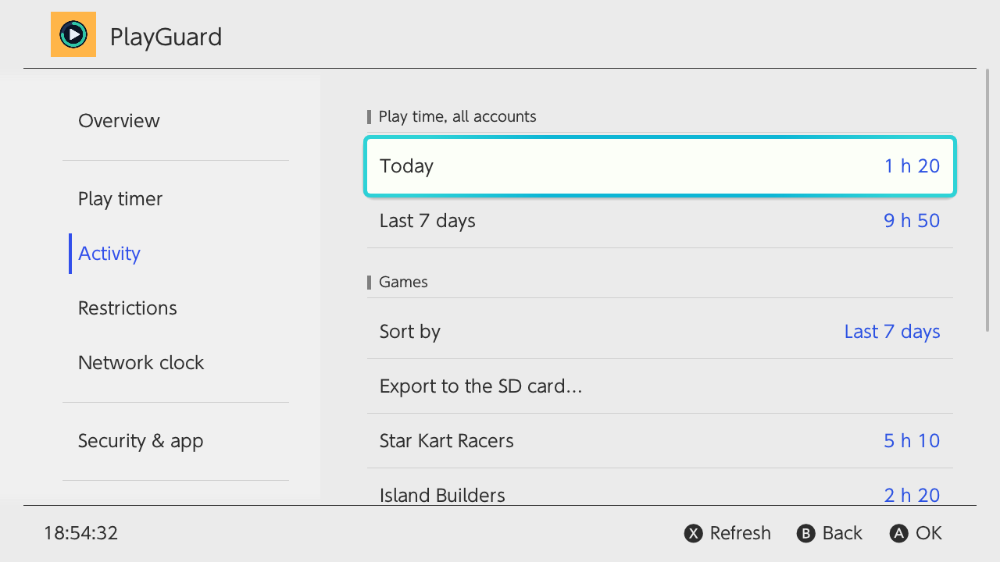
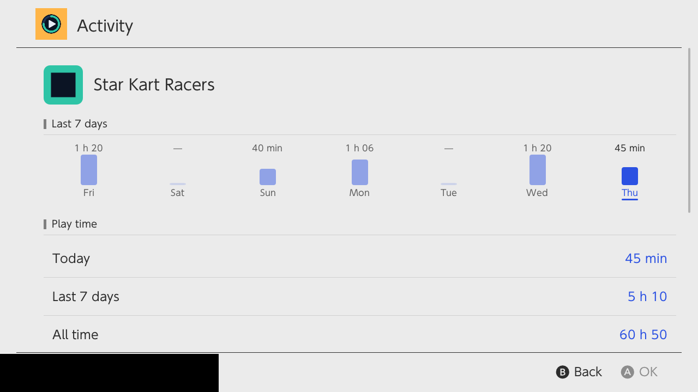
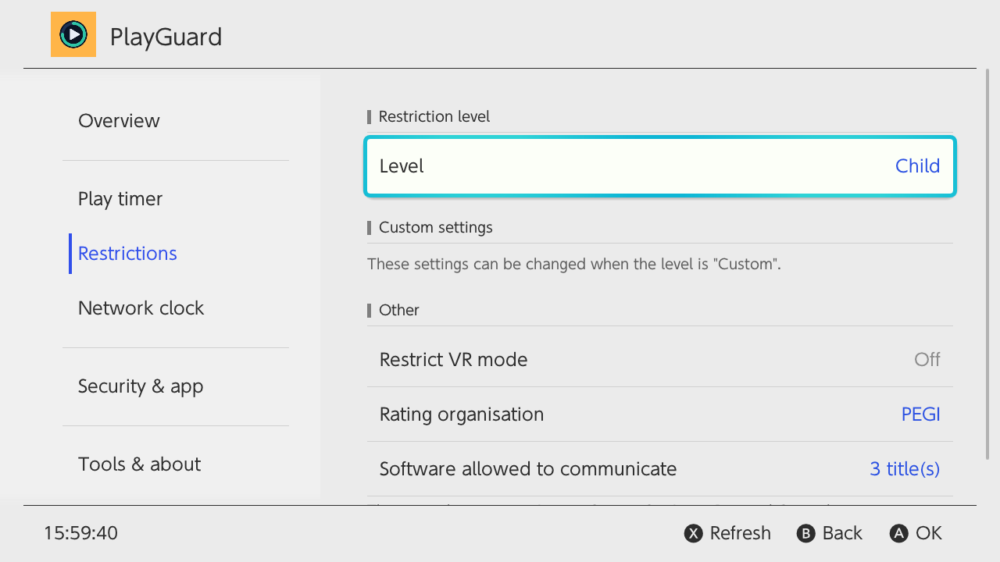
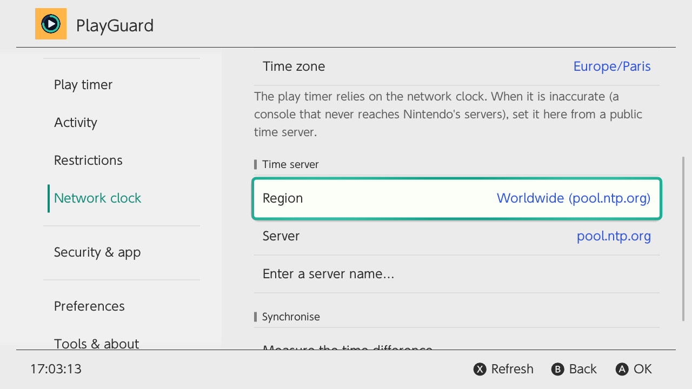
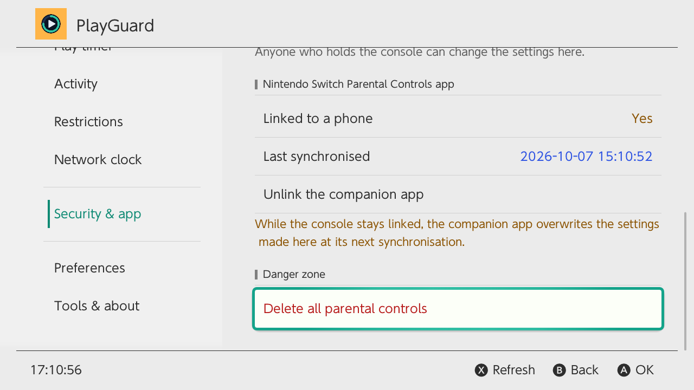
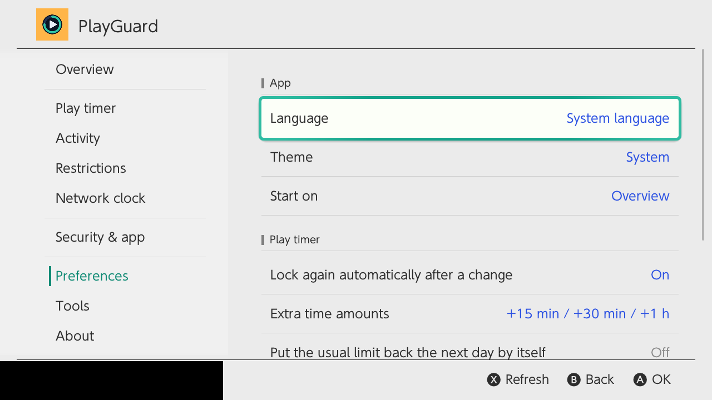

# PlayGuard


[](https://github.com/JigSawFr/PlayGuard/actions/workflows/build.yml)
[](https://github.com/JigSawFr/PlayGuard/releases/latest)
[](https://github.com/JigSawFr/PlayGuard/releases)
[](LICENSE)

**English** · [Français](README.fr.md)

**Nintendo Switch parental controls, right on the console — no phone app, no Nintendo account, no internet.**

PlayGuard is a homebrew app that brings the settings of the [Nintendo Switch Parental Controls](https://apps.apple.com/fr/app/contr%C3%B4le-parental-nintendo-sw/id1190074407) phone app onto the console itself, for offline use: daily play-time limits, restrictions, PIN, network clock, play activity — and a way back in when you are locked out. What it covers of the phone app, and what is still missing: [docs/companion-app.md](docs/companion-app.md).



> [!WARNING]
> **Requires custom firmware (Atmosphère).** PlayGuard talks to the restricted system `pctl` service, so it only runs on a modded console. It does not bypass any account or online check, and some of the commands it uses are `*ForDebug` ones. **Use at your own risk.**

## Contents

- [Why PlayGuard](#why-playguard)
- [Highlights](#highlights)
- [Compatibility](#compatibility)
- [Install](#install)
- [Quick start](#quick-start)
- [Features, tab by tab](#features-tab-by-tab)
- [Safety by design](#safety-by-design)
- [Locked out?](#locked-out-second-hand-console-forgotten-pin)
- [PlayGuard or a replacement sysmodule?](#playguard-or-a-replacement-sysmodule)
- [Reporting a bug](#reporting-a-bug)
- [Contributing](#contributing)
- [License and credits](#license-and-credits)

## Why PlayGuard

Children love video games, and video games mean screens: a limit is part of looking after them. On an unmodified Switch, Nintendo's phone app took care of it. Once the console runs custom firmware, a whole new world opens up — and parental control goes out of the window, because the phone app no longer reaches the console. Knowing how long they played, setting a limit, getting the game stopped without a fight or one more "five more minutes" became hard.

The few tools that existed did not do the job: activity reports that were barely maintained and not very detailed, parental controls that were rough and unfinished. And I did not want a custom replacement either, or a sysmodule always running in the background. The idea was to **reuse the console's own parental controls as much as possible**, with everything they already do — the limit, the PIN, the warnings, the suspension — and to bring their settings back onto the console. That is PlayGuard.

Driving the console's own controls also opens the door to much more: reporting play time to a home server, taking orders from it, Home Assistant, automations. Where that could go is in the [roadmap's horizon](ROADMAP.md#horizon).

## Highlights

- ⏱️ **Daily play-time limit** — the same every day or one per day, edited on a week chart; saved **profiles** (*School week*, *Summer holidays* …); **extra time today** and **no more play today** in one press.
- 📊 **Activity** — time per game today, over 7 days and in all, per user account, with charts and **export** to CSV, JSON, XLSX or PDF.
- 🔒 **Restrictions and PIN** — restriction level, age rating and rating organisation, set / show the PIN, unlock temporarily, a one-switch **console lock**, and an optional PIN to open PlayGuard itself.
- 🕒 **Network clock** — measure against public NTP servers and set it, so the play timer counts correctly on a console that never reaches Nintendo.
- 📱 **Companion app** — see whether the phone app is linked and **unlink** it, even for a second-hand console.
- ↩️ **Change history, backups and undo** — every change PlayGuard makes is logged and can be reverted; settings can be backed up to the SD card.
- 🌍 **Every console language** — 15 catalogs, light and dark themes.
- 🛡️ **Safe writes** — the play timer is never written while it counts down, and no background process runs while a child plays.

| Play timer | Per-day limits |
|---|---|
|  |  |
| **Activity** | **A game** |
|  |  |
| **Restrictions** | **Network clock** |
|  |  |
| **Security & app** | **Preferences** |
|  |  |

## Compatibility

| | Supported | Notes |
|---|---|---|
| **Firmware** | **21.0.0 → 23.0.1** | The play-time limit layout (0x44 bytes) exists since 21.0.0; below that, every tab works except the play timer. |
| **Atmosphère** | **1.11.x → 1.12.0** | 1.12.0 adds 23.0.0 support. The app shows the detected version. |
| **Launchers** | hbmenu, **sphaira**, **Homebrew App Store** | Launching over a game (title override) is recommended. The app says whether it runs as an application or as an applet (album). Over a game, the console counts PlayGuard's time as that game's. In the activity, it goes to the user picked at launch: open it with a parent's user, not a child's. The play timer is the console's, the same for every user: it counts that time whoever opened PlayGuard (unless the timer is off). |
| **Tested on hardware** | 22.1.0 / Atmosphère 1.11.1 | 23.0.1 / 1.12.0 is covered by the command table ([switchbrew](https://switchbrew.org/wiki/Parental_Control_services)) but not yet tested on hardware — reports are welcome. |

**Newer firmware?** PlayGuard opens **read-only** and checks whether a newer release supports it. If one does, it offers to update through sphaira or the Homebrew App Store. Otherwise you choose: read-only, read-only with the developer tools (to investigate the firmware), or every feature at your own risk. The choice can be remembered for that firmware and app version; *Tools › Compatibility* brings the screen back.

## Install

Pick one:

| Channel | How |
|---|---|
| **Homebrew App Store** / **sphaira's App Store** (same catalogue) | Search for *PlayGuard* once the listing is approved. New releases are picked up automatically. |
| **sphaira › GitHub** | The release zip already contains the entry (`/config/sphaira/github/playguard.json`): after a first install, update from *GitHub* in sphaira. |
| **Manual** | Download `playguard.zip` from the [latest release](https://github.com/JigSawFr/PlayGuard/releases/latest) and extract it to the **root** of the SD card. The app lands in `sd:/switch/playguard/`. |

The optional **recovery sysmodule** (`playguard-rescue.zip`) is a separate download — see [Locked out?](#locked-out-second-hand-console-forgotten-pin).

<details>
<summary>Files PlayGuard writes on the SD card</summary>

All in `sd:/switch/playguard/`:

| Path | Content |
|---|---|
| `config.json` | Preferences (language, theme, NTP server, *Ask for the PIN* …); every key in [docs/config.md](docs/config.md) |
| `history.json` | The change history (newest 200) |
| `profiles/` | Saved play-time limit profiles |
| `backups/` | Settings backups (never contain the PIN) |
| `exports/` | Activity exports |
| `cache/` | The last play activity read (every account, and each account viewed), shown at once on the next start while the log is read again; in developer mode, the list of *Install another build* (`dev_builds.json`) |
| `github_token` | Developer mode only: the GitHub sign-in of *Install another build* (deleted by signing out) |
| `rescue_report.txt` | Left by the recovery sysmodule after it acted, until PlayGuard shows it at start-up |
| `logs/` | Diagnostic reports (never contain the PIN or the serial number), the developer tools' files, `uploads.txt` (the links of the reports sent online) and `crash.txt` (what made PlayGuard stop, if it ever crashed) |

More in [packaging/README.md](packaging/README.md).
</details>

## Quick start

1. **Parental controls not set up yet?** Open PlayGuard: the *First steps* guide sets the PIN (system PIN screen), the daily limit, and checks the network clock.
2. **Paired with the phone app?** *Security & app › Unlink the companion app* — otherwise its next sync overwrites what you set here.
3. Set the limit: *Play timer › Same limit every day* (or *A different limit for each day…*).
4. **Network clock inaccurate** (shown on the Overview)? Turn on *Synchronise Clock via Internet* in System Settings, then *Network clock › Measure* and *Set the network clock*.

**Controls:** ↑/↓ move · Ⓐ confirm · Ⓑ back or cancel (twice on the sidebar to exit) · Ⓧ refresh · **+** saves per-day limits.

What failed is said in a dialog, what worked in a toast. The title says when the app is read-only or while parental controls are temporarily unlocked; in read-only mode, actions stay in place, greyed, and say why when pressed.

## Features, tab by tab

The app is organised in tabs, like System Settings. Click a tab to expand it.

<details>
<summary><b>Overview</b> — today at a glance</summary>

- **Today first:** a gauge of today's play time (while no game is running, the time from the activity log, marked ≈), today's limit, time left, bedtime alarm. The "time's up" alarm shows in amber while it is off — Ⓐ turns it back on.
- **Then the state:** parental controls, PIN, restriction level.
- **Then what needs attention:** network-clock accuracy, companion-app link (amber while linked), firmware / compatibility only when there is a problem, serial blanking and game patches warnings.
- Lines that open another tab end with a chevron (›). Ⓐ on *Today's limit* changes it in place; Ⓐ on *Network clock › Inaccurate* measures and sets the clock on the spot.
- **Extra time today** (+15 min, +30 min, +1 h by default) and **No more play today** (limit 0 for today only; the game in progress is suspended at the lock, and the confirmation says so). The next day — at start-up, or at midnight if the app is open — PlayGuard offers to put the usual limit back, or does it by itself (*Preferences › Put the usual limit back the next day by itself*).
- A **Lock now** banner while parental controls are temporarily unlocked.
- While no PIN is set, a **First steps** line opens the three-step guide, which also comes up at start-up.
- Refreshes every 5 s, with the time of the last refresh (Ⓧ refreshes now).
</details>

<details>
<summary><b>Play timer</b> — the week chart is the editor</summary>

- A state line: active, time left, today's limit, the matching profile (red while the limit is reached).
- **The week chart:** ←/→ pick a day, Ⓐ changes its limit.
- **Same limit every day:** a quick list or any value, typed in minutes (`90`, `90 min`) or hours (`1:30`, `1h30`).
- **A different limit for each day:** unsaved days in amber, quick values, Monday–Friday / weekend presets, "no limit" per day; **+** saves from anywhere.
- **Remove the limit**, **extra time today**, **no more play today** (as on the Overview).
- **Profiles** saved on the SD card: apply, edit, rename or delete one; save the current limits or make a new one. Any name, accents included — two names that would map to the same file are caught.
- Every confirmation draws the week as it will be, with the days that change in amber.
- **Bedtime alarm**: the alarm time (16:00 to 23:45, or off) and when play is allowed again (05:00 to 09:00), the same every day. Its place in the play-timer settings was worked out from the companion app's settings, not read on a console with a bedtime set: PlayGuard changes it only once the console reports what PlayGuard reads there, checks the console's answer after the change and puts the previous settings back if it differs. Advanced, opt-in: "time's up" alarm on/off, pause / resume the countdown.
- `0` minutes means *no play that day*; *Remove the play-time limit* turns the timer off.
</details>

<details>
<summary><b>Activity</b> — who played what, and how long</summary>

- Time per game **today**, in the **last 7 days** and **in all**, from the console's own activity log — for every account or **one user account** (*Account*, when the console has several).
- A chart of the last seven days, with each day's limit as a line and the time over it in amber; today's, the week's and all-time totals.
- Sort by period; the first games show their icon (not in applet mode, to spare memory).
- Ⓐ on a game: its last seven days as bars, launches, first and last play, time per user account. Deleted games keep their all-time figures.
- **Export to the SD card** as CSV, JSON, XLSX (Excel) or PDF, one column per day.
- Opens at once on the last figures read (kept on the SD card between runs), refreshed in the background when over a minute old; Ⓧ reads them again now, with a spinner.
- Times are approximate if the console clock was changed.
</details>

<details>
<summary><b>Restrictions</b> — level, age rating, communication</summary>

- Restriction level: None, Young child, Child, Teen, Custom. What a preset restricts (age limit, posting, communication) is shown read-only, and said before you pick it.
- In Custom: age rating, social-media posting, communication with others.
- VR mode, **rating organisation** (PEGI, ESRB, USK, CERO …).
- The number of games allowed to communicate (the list itself is in the diagnostic report, raw, until its layout is known).
</details>

<details>
<summary><b>Network clock</b> — the clock the play timer relies on</summary>

- Console and network clocks, time zone, accuracy.
- Pick a public NTP server (≈ 50 built in, by region, or your own).
- **Measure** against 3 servers (median; an amber warning when they disagree), then **set the network clock** — a measurement stays usable for 2 minutes, with a countdown.
- A console that never reaches Nintendo's servers keeps this clock inaccurate, which skews the play timer.
</details>

<details>
<summary><b>Security & app</b> — PIN, locks, companion app</summary>

- **Set / change the PIN** (system PIN screen), **show the PIN** (after a warning, for when it is forgotten), **unlock temporarily**, **lock now**.
- **Ask for the PIN** in PlayGuard itself: *Never*, *Before a change* (anyone can look, only the parent changes something; asked again after 5 min) or *To open PlayGuard*. Checked in the service layer, so no change skips it; locking again never asks.
- **Console lock:** one switch that sets every day's limit to 0, so a PIN is needed to start a game — a light lock without age ratings or communication limits. It blocks starting games, not the HOME menu, and needs a PIN. The previous limits come back when it is turned off. While it is on, *extra time* and *no more play today* are refused, and limits set another way (a profile, a backup, the history…) replace it.
- **Companion app:** whether the Nintendo Switch Parental Controls app is linked, its last sync, and **unlink** (otherwise its next sync overwrites the limits set here).
- **Delete all parental controls:** two confirmations, irreversible; a backup of the settings is saved first.
</details>

<details>
<summary><b>Preferences</b></summary>

- Language (every console language, or the console's own) and theme (light / dark, with an offer to restart).
- The tab to start on.
- **Lock again automatically after a change** (on by default).
- Extra-time amounts (+15/+30/+1 h, +10/+20/+30 min …) and putting the usual limit back the next day by itself.
- A network-clock check at start-up (a toast when it is more than a minute off; it never sets the clock).
- A **monthly reminder to support PlayGuard** (on by default, never in the first month nor right after an update; *Don't show again* on the reminder or this switch turns it off for good, updates included).
- Advanced actions.
</details>

<details>
<summary><b>Tools</b> and <b>About</b> — history, backups, console info; version, updates, what's new, credits</summary>

- **Change history:** what PlayGuard changed (limits, restriction level, PIN, unlocks, unlinking, the clock, restores …), when and from where. Ⓐ on a change shows it and, for a value, **puts the previous one back** — through the same unlock and PIN as any change, saying if it changed since.
- **Back up / restore the settings** on the SD card: restriction level, custom settings, VR mode, rating organisation, daily limits, the "time's up" alarm (with the advanced actions on), and the raw play-timer block for the record — never the PIN. A restore lists only what would change. Choose how many backups to keep.
- **First steps** opens the guide again (with an *Unlink the companion app* step while linked, a *Turn the "Time's up" alarm back on* step while it is off, and a switch to stop it coming up at start-up). Below *Close*, *Support PlayGuard* shows the funding QR codes.
- **Export a diagnostic report**, or **send one online** (see [Reporting a bug](#reporting-a-bug)).
- **Console:** firmware, Atmosphère, compatibility, storage (emuMMC or sysMMC), whether Atmosphère **blanks the serial number** (partly hidden until Ⓐ; a warning on emuMMC when it is not), **game patches** (sys-patch or sigpatch files, recommending sys-patch when only files are used).
- **About** (its own tab): version, launch mode and data folder; **updates** (check now or once a day at start-up; *Update with* sphaira, Homebrew App Store or by hand); **what's new** in the running version (its entry of the bundled changelog, in English); the credits, how to **support PlayGuard** ([GitHub Sponsors](https://github.com/sponsors/JigSawFr), [Ko-fi](https://ko-fi.com/jigsawfr), shown as QR codes to scan with a phone), and a small *Made in France* 🇫🇷. After an update, PlayGuard opens once on **What's new in X.Y.Z** (the same notes, then the QR codes).
</details>

## Safety by design

**Writing the play-time limit safely.** Overwriting the timer's configuration while it counts down destabilises Atmosphère. So PlayGuard checks the state first; if the timer is active, the confirmation says parental controls will be unlocked temporarily — with the stored PIN, **you don't need to remember it**. One press then unlocks, checks that the system really reports the unlock, writes, and **locks again right away** (or offers to, if *Lock again automatically after a change* is off). The service layer re-checks the state just before writing, so no screen can skip the safeguard.

> [!CAUTION]
> A limit below the time already played today suspends the game as soon as parental controls are locked again. The confirmation says so when that would happen.

**No more 22.5 crashes.** `pctl:a`, the privileged parental-control service, accepts a **single session**. Older builds of the original app kept it open, so the HOME-menu PIN prompt (or the PIN applet) could not get it and Atmosphère could crash. PlayGuard opens the session for each action and releases it immediately; periodic refreshes pause while the app is in the background. *(Diagnosis by [anbingxi's fork](https://github.com/anbingxi/NX-Pctl-Manager/tree/diag/fw22-5-readonly).)*

**Nothing runs in the background.** The limit, the PIN, the warnings and the suspension are the console's own; PlayGuard only changes their settings.

## Locked out? (second-hand console, forgotten PIN)

PlayGuard only sees the parental controls of the system it runs on: **emuMMC and sysMMC each have their own** (a PIN removed on one is still there on the other). Run it on each one that needs fixing.

| Situation | What to do |
|---|---|
| **Second-hand console:** you know the PIN, but the previous owner's phone app is still linked (unlinking fails, or a factory reset asks for their account) | *Security & app › Unlink the companion app*, then, if you want no parental controls at all, *Delete all parental controls*. Both work offline, on emuMMC as on sysMMC. |
| **PIN forgotten** | *Security & app › Show the PIN*. Or *Delete all parental controls* to start again (a settings backup is saved first; it never contains the PIN). |
| **PIN forgotten, and *Ask for the PIN* is set to *To open PlayGuard* or *Before a change*** | That setting lives in `sd:/switch/playguard/config.json` on purpose: put the SD card in a computer and set `"pin_lock"` to `"off"`. |
| **The play timer blocks everything (0-minute limit) and the PIN is forgotten** | PlayGuard itself cannot start then. Install the optional recovery sysmodule (`playguard-rescue.zip`) **beforehand**; when locked out, drop an empty `switch/playguard/RESCUE` file on the SD card and boot — it unlocks the console so PlayGuard can open. See [`sysmodule/README.md`](sysmodule/README.md). |
| **Console not modded** | PlayGuard cannot help: it needs Atmosphère. Nintendo support's master-key procedure is the official way. |

## PlayGuard or a replacement sysmodule?

PlayGuard drives the parental controls built into the console (the `pctl` service), offline. The other approach replaces them with a sysmodule, for instance [NS Parental Control](https://github.com/TristanIsrael/NSParentalControl) (a sysmodule and a Tesla / Ultrahand overlay).

| | PlayGuard | A replacement sysmodule |
|---|---|---|
| Play-time limit | One for the console (the console's own timer) | One per user account |
| PIN, warnings, suspension | The console's | Its own |
| In the background | Nothing (the optional recovery sysmodule only acts at boot, when a `RESCUE` file asks it to) | A sysmodule, from boot |
| After a firmware update | The console's controls keep working; PlayGuard opens read-only until a version supports the firmware | The controls depend on the sysmodule still working |
| Deleted from the SD card | The limits stay on the console | The controls go with it |

**Need a different limit for each child?** Pick a replacement sysmodule — the console's timer has one limit for the whole console. Otherwise, PlayGuard keeps Nintendo's controls and just brings their settings to the console.

## Reporting a bug

1. *Tools › Export a diagnostic report* saves a text file in `sd:/switch/playguard/logs/`: firmware, Atmosphère version, clocks, storage, serial-blanking and game-patch status, and the raw result of every parental-control query. **It never contains the PIN or the serial number.**
2. [Open an issue](https://github.com/JigSawFr/PlayGuard/issues/new) and attach it.

Or, with the console online, *Tools › Send a report online* (Ⓧ on the diagnostic report in developer mode) sends it, with the debug files (the play-timer block reference, the end of the play-timer recording, the change history and PlayGuard's settings), to [bpa.st](https://bpa.st) or, when PlayGuard is signed in to GitHub (developer tools), to a secret gist in your account (offered first), after saying exactly what goes. It shows the link and two QR codes: the report, and the bug-report form with the link and your versions already filled in. Anyone with the link can read the report: for one month on bpa.st, which then deletes it, or until you delete the gist on GitHub. The links are kept in `logs/uploads.txt`, with bpa.st's removal link to delete a paste sooner. A report saved earlier in `logs/` can be sent the same way.

<details>
<summary>Developer mode (investigating a new firmware)</summary>

Press *About › Version* seven times; the developer tools appear at the end of *Tools*. It adds:

- a **read-only** switch — with it on, the app cannot change anything: the safe way to investigate a new firmware (the firmware screen offers it directly);
- the diagnostic report on screen (Ⓨ saves it, Ⓧ sends it online), and a shortcut to export it from the Play timer tab;
- **Install another build** in place, to test a fix before it is released: the latest release, one of the last 20 commits of `main`, or the newest build of an open pull request (forks included). The release needs nothing; the others are the build workflow's artifacts, which GitHub hands to signed-in users only: **GitHub account** signs in with a code and a QR code to scan with a phone (the only permissions asked are to read the build workflow's files (Actions) and to create gists, for *Send a report online*; otherwise the token can only read what is public; it is kept in `github_token`, never sent with a report, and *GitHub account* signs out). PlayGuard downloads the build, checks it (size, the SHA-256 GitHub records, the NRO header), puts it in place of its own `.nro` and restarts on it (behind *Ask for the PIN* when that is on). The list is kept for 10 minutes and shown at once (its last line, *Refresh the list*, fetches it again). The same list goes back to the release at any time; *About › Version* shows the commit in developer mode. Artifacts expire after 90 days;
- **Compare the play-timer block**, to decode settings PlayGuard does not show yet: save the raw block as a reference, change one setting in the phone app, come back — PlayGuard lists the values that changed (saved in `logs/` on request). "Alarm only" vs "suspend the software" could be found this way, and the bedtime fields confirmed. Attach that file to an issue, or send it with the report (*Send a report online*).
- **Record the play timer**: every 30 s while PlayGuard is open, one line of what the play timer reports (time left, time spent, the raw settings block…) in `logs/play_timer_log.csv`, a spreadsheet-ready file, plus a line right after each change PlayGuard makes, saying which (its last column, `event`), and a note when the clock moved more than the time that went by. Left open over midnight, or until the time is up, it shows what one report cannot: when the time spent resets, what the console says near the end. The switch is remembered; it only records in developer mode. What is known so far is in [docs/parental-controls.md](docs/parental-controls.md).
</details>

## Contributing

Build instructions, the desktop simulator, the code layout, the release process and how to translate PlayGuard are in **[CONTRIBUTING.md](CONTRIBUTING.md)**. What comes next, and the ideas waiting for a decision: **[ROADMAP.md](ROADMAP.md)**.

Quick taste:

```sh
make test      # unit tests of the C service layer (no devkitPro needed)
make desktop   # the real UI on Linux, against a simulated console
make dist      # playguard.zip (devkitPro switch-dev)
```

Translations from native speakers are especially welcome — PlayGuard ships English, French (France, Canada), German, Spanish (Spain, Latin America), Italian, Dutch, Portuguese (Portugal, Brazil), Russian, Japanese, Korean and Chinese (simplified, traditional).

## License and credits

GPLv3 — see [`LICENSE`](LICENSE). Maintained by **[JigSawFr](https://github.com/JigSawFr)**.

- A fork of **Pctl Manager** by **Taylor** ([tailiang2008](https://github.com/tailiang2008)) (v2–v3): the original pctl service layer, play-timer write gate and borealis UI. Its history is in [CHANGELOG.md](CHANGELOG.md).
- UI: **[borealis](https://github.com/xfangfang/borealis)** (Apache 2.0), pinned at `extern/borealis/`.
- QR codes: **[QR Code generator](https://github.com/nayuki/QR-Code-generator)** by Project Nayuki (MIT), in `extern/qrcodegen/`.
- fw 22.5 diagnosis, session release and NTP synchronisation adapted from **[anbingxi/NX-Pctl-Manager](https://github.com/anbingxi/NX-Pctl-Manager/tree/diag/fw22-5-readonly)**.
- Command reference: [switchbrew — Parental Control services](https://switchbrew.org/wiki/Parental_Control_services).

> [!NOTE]
> **How PlayGuard is built.** AI coding assistants were used alongside development: writing and reviewing code, translations and documentation. PlayGuard's changes are driven, reviewed and validated by a professional developer, covered by the C unit tests and the desktop simulator, and tested on a real console (22.1.0 / Atmosphère 1.11.1) before release.

PlayGuard is not affiliated with or endorsed by Nintendo. Nintendo Switch is a trademark of Nintendo.
